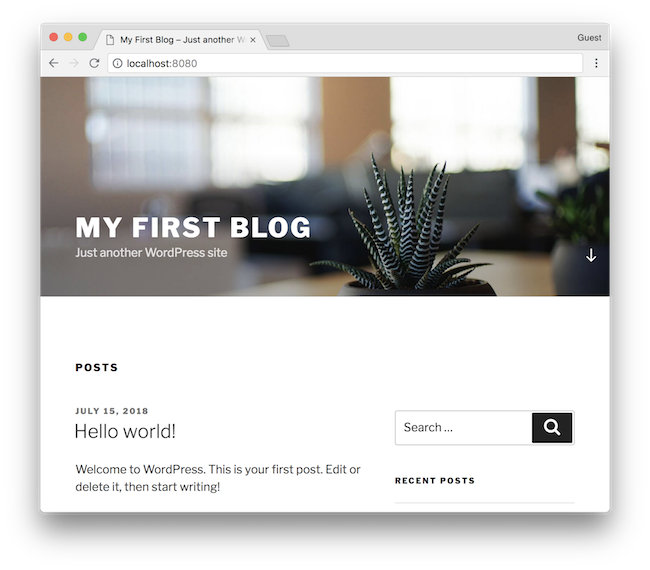

# wordpress-docker-compose

Docker Compose for WordPress



## Run the server

```bash
cd <this repo>
docker-compose up
```

Wait for while, then you can access to <http://localhost:8080/>.

## Data Persistence

`./docker_volumes/` has persistence data for both WordPress and Database.
